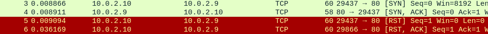
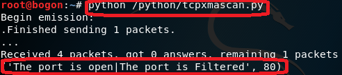

# chapter0x02 网络扫描

## 一、实验任务：

编程实现：

- TCP connect scan
- TCP stealth scan
- TCP XMAS scan
- UDP scan
## 二、知识准备：

- TCP Flag含义：  
	- SYN（0x002）：建立新的TCP连接
	- ACK（0x010）：确认数据包的成功接收
	- RST（0x004）：拒绝连接，表示连接重置
	- FIN：拆除使用上一个标志（SYN）创建的虚拟连接
	- SYN,ACK（0x012）
	- RST,ACK（0x014）
- TCP Connect Scan：
	- TCP连接是客户端和服务器之间的三次握手
	- 服务器的客户端通过发送设置了SYN标志的TCP数据包和它想要连接的端口来初始化连接。如果服务器上打开端口并且接受连接，则它将使用设置了SYN和ACK标志的TCP数据包进行响应。该连接由客户端在最终握手中发送确认ACK和RST标志来建立。
	- 完成三次握手后，服务器上的端口处于打开状态。
- TCP Stealth Scan：
	- 类似于TCP连接扫描。客户端发送一个TCP数据包，其中设置了SYN和要连接的端口号。如果端口打开，服务器将使用TCP数据包内的SYN和ACK标志进行响应。但是在TCP数据包中发送的是RST标志而不是RST + ACK。
	- 此技术用于避免防火墙检测端口扫描。
- TCP XMAS Scan：
	- 在XMAS扫描中，将设置了PSH，FIN和URG标志的TCP数据包和要连接的端口发送到服务器。如果端口已打开，则服务器将不会响应。
	- 如果服务器响应TCP数据包内设置的RST标志，则服务器上的端口关闭。
	- 如果服务器使用ICMP数据包type3和ICMP的code1,2,3,9,10或13进行响应，则端口将被过滤，无法从响应中推断出端口是打开还是关闭。
- UDP Scan：
	- TCP是面向连接的协议，UDP是无连接协议。
	- 客户端发送一个UDP数据包，其中包含要连接的端口号。如果服务器使用UDP数据包响应客户端，则该特定端口在服务器上打开。
	- 客户端发送UDP数据包和它想要连接的端口号，但服务器响应ICMP端口不可达错误type3和code3，这意味着端口在服务器上关闭。
	- 如果服务器使用ICMP的type3和code1,2,9,10或13响应客户端，则会过滤服务器上的该端口。
	- 如果服务器没有对该端口的客户端UDP请求数据包发送任何响应，则不可以断定服务器上的端口是打开的还是已过滤的。
## 三、实验过程：  
### TCP Connect 扫描  

 - 发送一个SYN数据包到目标主机的特定端口上，接着我们可以通过接收 包的情况对端口的状态进行判断：

	- 收到SYN/ACK数据包--开放,发送一个ACK确认包到目标主机
	- 收到RST/ACK数据包--关闭
	- 目标主机没有响应 --过滤

- 保证主机Attacker和Victim在同一个局域网下，能互相ping通
- 编写tcp connect scan的代码  
	

		#! /usr/bin/python
		import logging
		logging.getLogger("scapy.runtime").setLevel(logging.ERROR)
		from scapy.all import *
		
		dst_ip = "10.0.2.9"
		src_port = RandShort()
		dst_port = 80
		
		tcp_connect_scan_resp = sr1(IP(dst=dst_ip)/TCP(sport=src_port,dport=dst_port,flags="S"),timeout=10)
		if(str(type(tcp_connect_scan_resp))=="<type 'NoneType'>"):
		    print("<type 'NoneType'>.The port is closed",dst_port)
		elif(tcp_connect_scan_resp.haslayer(TCP)):
		    if(tcp_connect_scan_resp.getlayer(TCP).flags == 0x12):
		        send_rst = sr(IP(dst=dst_ip)/TCP(sport=src_port,dport=dst_port,flags="AR"),timeout=10)
		        print ("The port is open",dst_port)
		    elif (tcp_connect_scan_resp.getlayer(TCP).flags == 0x14):
		        print ("The port is closed",dst_port)

- 在Attacter中运行编写的脚本，同时在Victim中监听   

	    
	
	
    
	  
	- 可以看到输出为“the port is Closed”，并且监听到的包只有SYN包和RST包，说明Victim的80端口是关闭状态。  
- 在Victim中打开80端口后，重新发包，并进行监听

	`nc -l -p 80`

	   
	
	- 看到80端口为Open状态，TCP完成了三次握手  
### TCP stealth 扫描  
- 也称TCP SYN扫描，发送一个SYN包给目标主机：

	- 收到SYN/ACK数据包--开放，发送一个RST给目标主机立即拆除连接
	- 收到RST/ACK数据包--关闭
	- 目标主机没有响应--过滤

- 编写tcp stealth的脚本   

		 #! /usr/bin/python
		
		import logging
		logging.getLogger("scapy.runtime").setLevel(logging.ERROR)
		from scapy.all import *
		
		dst_ip = "10.0.2.9 "
		src_port = RandShort()
		dst_port=80
		
		stealth_scan_resp = sr1(IP(dst=dst_ip)/TCP(sport=src_port,dport=dst_port,flags="S"),timeout=10)
		if(str(type(stealth_scan_resp))=="<type 'NoneType'>"):
		    print("The port is Filtered",dst_port)
		elif(stealth_scan_resp.haslayer(TCP)):
		    if(stealth_scan_resp.getlayer(TCP).flags == 0x12):
		        send_rst = sr(IP(dst=dst_ip)/TCP(sport=src_port,dport=dst_port,flags="R"),timeout=10)
		        print("The port is open",dst_port)
		    elif (stealth_scan_resp.getlayer(TCP).flags == 0x14):
		        print("The port is close",dst_port)
		elif(stealth_scan_resp.haslayer(ICMP)):
		    if(int(stealth_scan_resp.getlayer(ICMP).type)==3 and int(stealth_scan_resp.getlayer(ICMP).code) in [1,2,3,9,10,13]):
		        print("The port is Filtered",dst_port)

- 在Attacter中运行编写的脚本，同时在Victim中监听

	  
	   

	- 可以看到输出为“the port is Closed”，并且监听到的包只有SYN包和RST包，说明Victim的80端口是关闭状态。  
- 在Victim中打开80端口后，重新发包，并进行监听

	  
	    
	- 看到80端口为Open状态，TCP完成了三次握手

### TCP XMAS 扫描  
- 发送一个TCP包，并对TCP报文头FIN、URG和PUSH标记进行设置：

	- 收到RST报文--关闭
	- 目标主机没有响应--开放/过滤

- 编写tcp xmas scan的代码

		import logging
		logging.getLogger("scapy.runtime").setLevel(logging.ERROR)
		from scapy.all import *
		
		dst_ip = "10.0.2.9"
		src_port = RandShort()
		dst_port = 80
		
		xmas_scan_resp = sr1(IP(dst=dst_ip) / TCP(dport=dst_port, flags="FPU"), timeout=10)
		if (str(type(xmas_scan_resp)) == "<type 'NoneType'>"):
		    print("<type 'NoneType'>.The port is open|The port is Filtered",dst_port)
		elif (xmas_scan_resp.haslayer(TCP)):
		    if (xmas_scan_resp.getlayer(TCP).flags == 0x14):
		        print("the tcpflags:0x14.The port is closed",dst_port)
		elif (xmas_scan_resp.haslayer(ICMP)):
		    if (int(xmas_scan_resp.getlayer(ICMP).type) == 3 and int(xmas_scan_resp.getlayer(ICMP).code) in [1, 2, 3, 9, 10, 13]):
		        print("ICMP error type:3.The port is Filtered",dst_port)

- 在Attacter中运行编写的脚本，同时在Victim中监听

	  
	   

	- 可以看到输出为“the port is Closed”，并且监听到的包只有SYN包和RST包，说明Victim的80端口是关闭状态。  
- 在Victim中打开80端口后，重新发包，并进行监听  

	    
	 
     
	- 看到80端口为"the port is Closed | the port is filtered"状态，只能监听到一个UDP包，没有回复

### UDP 扫描 
- 向各个被扫描的UDP端口发送零字节的UDP数据包：

	- 收到一个ICMP不可到达的回应--关闭
	- 目标主机没有响应--开放/过滤
	- 收到UDP和ipv4--开放

- 编写UDP scan的代码

		import logging
		
		logging.getLogger("scapy.runtime").setLevel(logging.ERROR)
		from scapy.all import *
		
		dst_ip = "10.0.2.2"
		src_port = RandShort()
		dst_port = 53
		dst_timeout = 10
		
		udp_scan_resp = sr1(IP(dst=dst_ip) / UDP(dport=dst_port), timeout=dst_timeout)
		if (str(type(udp_scan_resp)) == "<type 'NoneType'>"):
		      print("The port is open|The packet is Filtered",dst_port)
		elif ((udp_scan_resp.haslayer(UDP)) or udp_scan_resp.getlayer(IP).proto == IP_PROTOS.udp):
		     print("The port is open",dst_port)
		elif (udp_scan_resp.haslayer(ICMP)):
		    if (int(udp_scan_resp.getlayer(ICMP).type) == 3 and int(udp_scan_resp.getlayer(ICMP).code) == 3):
		         print("The port is closed",dst_port)
		    elif (int(udp_scan_resp.getlayer(ICMP).type) == 3 and int(udp_scan_resp.getlayer(ICMP).code) in [1, 2, 9, 10, 13]):
		        print("The packet is Filtered",dst_port)

- 在Attacter中运行编写的脚本，同时在Victim中监听

	  
	   

	- 可以看到输出为“the port is Closed”,并且有一个UDP包和一个ICMP Error(信息：Type 3, Code 3),说明Victim的53端口是关闭状态。 
- 在Victim中打开53端口后，重新发包，并进行监听  

	`nc -u -l -p 53 < /etc/passwd `

	    
	        
	- 看到53端口为"the port is open"状态，并且有一个UDP包和ipv4的回复

- 实验中发现第一次没有抓到ipv4的包，只有UDP和ICMP Error包其实说明端口是关闭的，但是脚本或者用nc命令查看53端口时是open状态，是因为如果在victim上开启了防火墙，防火墙把包DROP了，是收不到icmp端口不可达消息的，那么使用nc命令就会发现实际不通的端口是通的。这是因为UDP不像TCP一样需要ACK，所以过一段时间没收到端口不可达，UDP就认为端口是通的，但是实际上UDP数据被防火墙DROP了。

### nmap 扫描

> - nmap命令：
> 	- -sP：ping扫描
> 	- -sT：全链接扫描（TCP Connect）
> 	- -sS：半链接扫描（TCP Stealth）
> 	- -sX：XMAS扫描（TCP XMAS）
> 	- -sU：UDP扫描 
> 	- -p：扫描端口列表，默认扫描1-1024度端口和/usr/share/nmap/nmap-services文件中指定端口
> 	- -T<0-5>：设置时间顺序模型
> 	- -v：冗余模式扫描，可以得到扫描详细信息

#### 1. TCP connect 扫描
- 不监听80端口
	
	   
	  
- 监听80端口

	  
	 
#### 2. TCP stealth 扫描
- 不监听80端口
	
	   
	  
- 监听80端口

	  
	 
#### 3. TCP XMAS 扫描
- 不监听80端口
	
	   
	  
- 监听80端口

	  
	 
#### 4. UDP 扫描
- 用nmap扫描53端口，可以看到53端口显示为“关闭”状态：

	   
	     
- 打开53端口后，用nmap扫描，看到53端口显示为“开放”状态，文件可以传输

	`nc -u -l -p 53 < /etc/passwd `
	
	   
	   
### 实验总结
- nmap结果和scapy编程结果一致
- 当使用‘nc -ulp 53’开启53端口时，nmap扫描后并无法检测到53端口处于开启状态
### 参考资料
[nmap命令详解](http://blog.51cto.com/6226001001/1897606 "nmap")     
[端口扫描方法](https://blog.csdn.net/fion45/article/details/8878519 "端口扫描方法")  
[https://github.com/CUCCS/2018-NS-Public-xaZKX/](https://github.com/CUCCS/2018-NS-Public-xaZKX/)   
[https://resources.infosecinstitute.com/port-scanning-using-scapy/](https://resources.infosecinstitute.com/port-scanning-using-scapy/)