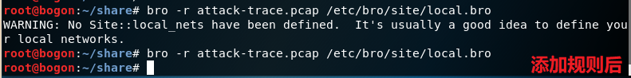
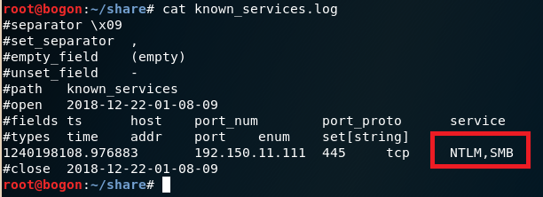

# chap0x12 实战Bro网络入侵取证

## 原始数据：

- 包含可疑流量的pcap数据包（attack-trace.pcap）

## 实验环境：

- 安装Bro

	    apt install bro bro-aux

- 实验环境的基本信息

## 实验内容：

- 通过分析pcap数据样本包，获取包含的TCP并发会话数量、攻击者和靶机的IP地址、靶机在此次安全事件中被利用的漏洞等信息。

## 基于Bro的分析：

### 一、什么是Bro？

- Bro是一款被动的开源流量分析器。它主要用于对链路上所有深层次的可疑行为流量进行安全监控，为网络流量分析提供了一个综合平台，特别侧重于语义安全监控。虽然经常与传统入侵检测/预防系统进行比较，但bro采用了完全不同的方法，为用户提供了一个灵活的框架，可以帮助定制，深入的监控远远超出传统系统的功能。 
- Bro的目标在于搜寻攻击活动并提供其背景信息与使用模式。它能够将网络中的各设备整理为可视化图形、深入网络流量当中并检查网络数据包;它还提供一套更具通用性的流量分析平台。 

### 二、实验步骤：

#### 1. 配置Bro

- 编辑 /etc/bro/site/local.bro，在文件尾部追加两行新配置代码

		@load frameworks/files/extract-all-files
		@load mytuning.bro

- 加载库指令，以@load来加载module中定义的命名空间，分别表示使用Bro提取所有文件，加载mytuning.bro中自己编写的命令
- 在 /etc/bro/site/目录下的mytuning.bro文件中，写入代码：

		redef ignore——checksums = T；

- 使Bro能够在系统上分析本地捕获的流量，忽略校验和验证。

#### 2.使用Bro分析流量包

- 在命令行中输入
		
		bro -r attack-trace.pcap /etc/bro/site/local.bro

- 其中

		-r：表示分析的为数据包
		attack-trace.pcap：待分析的数据包
		/etc/bro/site/local.bro：配置文件

	- 直接运行将会出现警告信息
	
			WARNING: No Site::local_nets have been defined. It's usually a good idea to define your local networks.

		对于本次入侵取证实验来说没有影响。
		如果要解决上述警告信息，也很简单，同样是编辑mytuning.bro，增加一行变量定义即可

		redef Site::local_nets = { 192.150.11.0/24 };
		
		- 其中{}中为本地网络的IP地址范围。添加后将会新增2个日志文件，报告待分析数据包中发现的本地网络IP和该IP关联的一直服务信息

	
	

	

#### 3. 在线分析extract_files目录下的文件，确定攻击类型

- 将extract_files目录下的文件上传到virustotal我们会发现匹配了一个历史扫描报告，该报告表明这是一个已知的后门程序！
- 基于这个发现就可以进行逆向倒推，寻找入侵线索了

#### 4. 阅读源代码分析入侵线索

- 阅读/usr/share/bro/base/files/extract/main.bro
- 通过阅读main.bro，可知文件名最后的id是file.log文件中的唯一标识符

- 通过查看files.log，发现该文件提取自网络会话标识（bro根据IP五元组计算出的一个会话唯一性散列值）为CAN3MF2aOibolRk5K8的FTP会话并获得对应的conn_uids。

- 该CAN3MF2aOibolRk5K8会话标识在conn.log中可以找到对应的IP五元组信息。并通过conn.log的会话标识匹配获得攻击者ip地址。

#### 5.log文件查看

    查看conn.log中所有可用的“列名”：grep ^#fields conn.log | tr '\t' '\n'  
    按照“列名”输出conn.log中我们所关注的一些“列”：bro-cut ts id.orig_h id.orig_p id.resp_h id_resp_p proto < conn.log  
    将UNIX时间戳格式转换成可读的时间：bro-cut -d conn.log  

## tshark与snort的配合使用

### 一、什么是snort：

一个强大的网络入侵检测系统。它具有实时数据流量分析和记录IP网络数据包的能力，能够进行协议分析，对网络数据包内容进行搜索匹配。它能够检测各种不同的攻击方式，对攻击进行实时报警。此外，Snort是开源的入侵检测系统，并具有很好的扩展性和可移植性。

### 二、实验步骤：

#### 1. 统计数据包内的流量信息

- 使用`tshark -r attack-trace.pcap -z ip_hosts,tree -qn`或wireshark端点统计工具来统计数据包内信息。

> 
>       -r 读取本地文件
>       -z 设置统计参数
>       -q 只在结束捕获时输出数据，针对于统计类的命令非常有用
>       -n 禁止网络对象名称解析

#### 2. 发现攻击者ip

- 使用命令`tshark -r attack-trace.pcap -Y "tcp.flags==0x02" -n`筛选建立tcp连接的数据包，发现攻击者ip为98.114.205.102

#### 3.查看攻击持续时间

- 执行`capinfos attack-trace.pcap`计算捕获到数据包的起始时间

#### 4. 利用snort进行行为分析

- 修改/etc/snort/snort.conf，将var HOME_NET后修改为[192.150.11.0/24]；执行`sudo snort -q -A console -c /etc/snort/snort.conf -r attack-trace.pcap`

> -q：不显示状态报告
> -A：信息输出到控制台
> -c：指定使用的配置文件
> -r：待分析的数据包

#### 5. 统计会话进行攻击过程划分

- 执行`tshark -r attack-trace.pcap -qnz conv,tcp`以表格的形式统计tcp会话

- 猜测：扫描/枚举、漏洞利用、执行攻击命令、FTP会话、下载恶意代码

#### 6. 利用wireshark追踪tcp流，线上分析tcp报文

- 打开wireshark，将tcp会话应用为过滤器，而后跟踪tcp流，获取完整报文信息。将报文信息存储到文件中，进行线上分析

- 经过在线分析为已知的蠕虫病毒 CVE-2003-0533 (MS04-011)   LSASS buffer overflow

## Bro的一些其他技巧
#### 设置显示捕获的FTP登陆口令
- 编辑 etc/bro/site/mytuning.bro 文件，添加一行代码，使ftp.log中显示捕获的FTP登陆口令

        redef FTP::default_capture_password = T;

- 添加代码前：

  

- 添加代码后

    

#### SMB协议识别

- 编辑 /etc/bro/site/local.bro 文件，添加一行代码，查看known_services.log使其能识别出SMB协议流量

    	@load protocols/smb

- 添加代码前：

  

- 添加代码后

   

## 参考文献

1. [https://sec.cuc.edu.cn/huangwei/textbook/ns/chap0x12/exp.html](https://sec.cuc.edu.cn/huangwei/textbook/ns/chap0x12/exp.html)

2. [https://www.jianshu.com/p/113345bbf2f7](https://www.jianshu.com/p/113345bbf2f7)

3. [https://www.freebuf.com/articles/system/135843.html](https://www.freebuf.com/articles/system/135843.html)

4. [http://sec.cuc.edu.cn/huangwei/course/2016/nsLecture0x12.pdf](http://sec.cuc.edu.cn/huangwei/course/2016/nsLecture0x12.pdf)