# **chap0x01基于VirtualBox的网络攻防基础环境搭建**
##一、实验环境
  - 主机：Windows 10 
  - 虚拟机：kali
  	- victim：4.17.0-kali1-amd64
  	- host：4.17.0-kali1-amd64
  	- gateway：4.17.0-kali1-amd64
##二、实验任务
- 节点：靶机、网关、攻击者主机
- 连通性 
	- 靶机可以直接访问攻击者主机
	- 攻击者主机无法直接访问靶机
	- 网关可以直接访问攻击者主机和靶机
	- 靶机的所有对外上下行流量必须经过网关
	- 所有节点均可以访问互联网
- 其他要求 
	- 所有节点制作成基础镜像（多重加载的虚拟硬盘）
##三、实验过程
- 网络拓扑图如下：
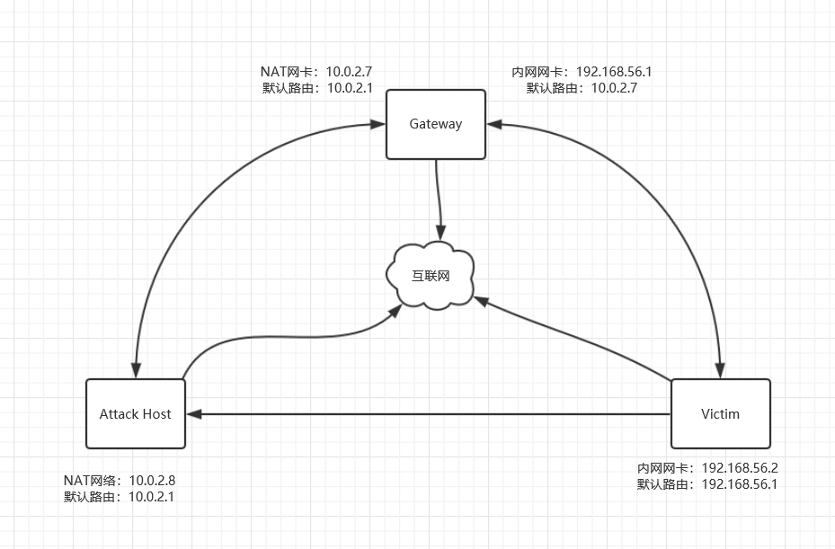
	- 根据网络拓扑图配置网络
		- gateway设置两块网卡（NAT和INTNET）
		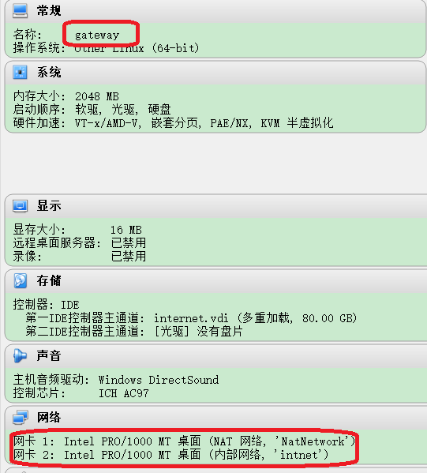
		- Attack Host设置一块NAT网卡  
		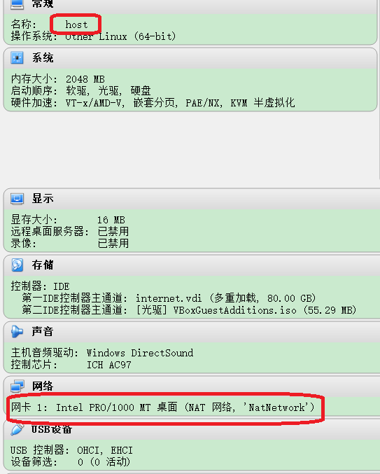
		- Victim设置一块INTNET网卡
		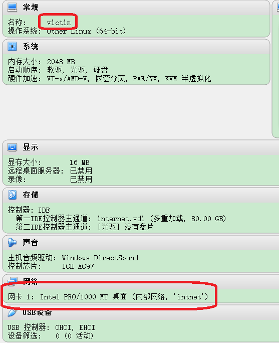
	- 给gateway和victim的INTNET分别设置静态IP地址
		- gateway
		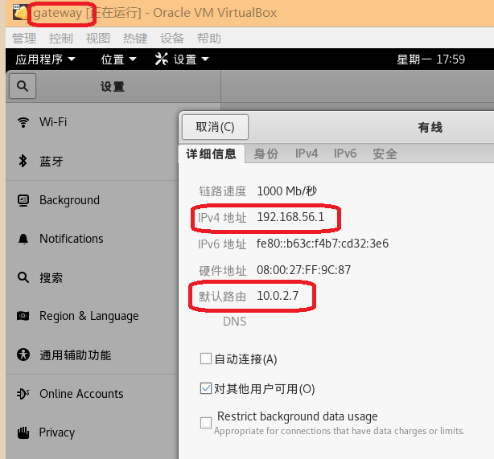
		- Victim
		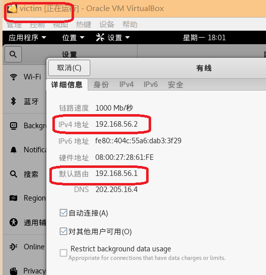
	- 给gateway和attack host的NAT启用DHCP
		- gateway
		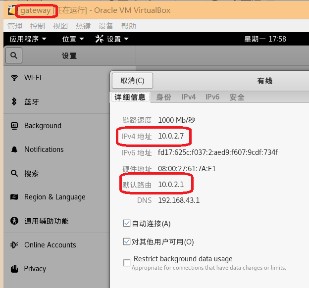
		- host
		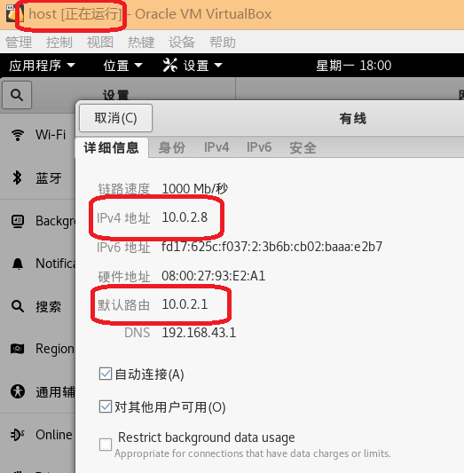
	- 经配置后的网络状态是： 
		- 网关可以直接访问攻击者主机和靶机
		- 攻击者主机无法直接访问靶机
		- 靶机可以无法直接访问攻击者主机
		- 靶机无法访问互联网
- 在gateway上添加防火墙规则，使得主机发送的echo reply可以回到gateway上，并进行查看
	- 	- 对设置防火墙命令的理解 `iptables -t nat -A POSTROUTING -s 192.168.0.0/24 -o eth0 -j MASQUERADE`  命令实现的功能是在NAT表中添加一条POSTROUTING规则，使得来自192.168.0.0/24网络的包能被转发到eth0。  
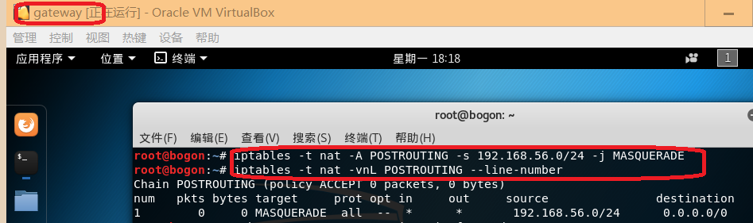
- 将文件ip_forward中的0改为1（临时开启ip转发，重启后消失），将sysctl.conf文件中net.ipv4.ip_forward的值改为1，删除#（永久开启ip转发，重启后不消失）Linux系统默认是禁止数据包转发的。所谓转发即当主机拥有多于一块的网卡时，其中一块收到数据包，根据数据包的目的ip地址将数据包发往本机另一块网卡，该网卡根据路由表继续发送数据包。这通常是路由器所要实现的功能。 （源地址转换）  

	echo 1 >/proc/sys/net/ipv4/ip_forward 
	
- 配置完成后，靶机就能ping通外网
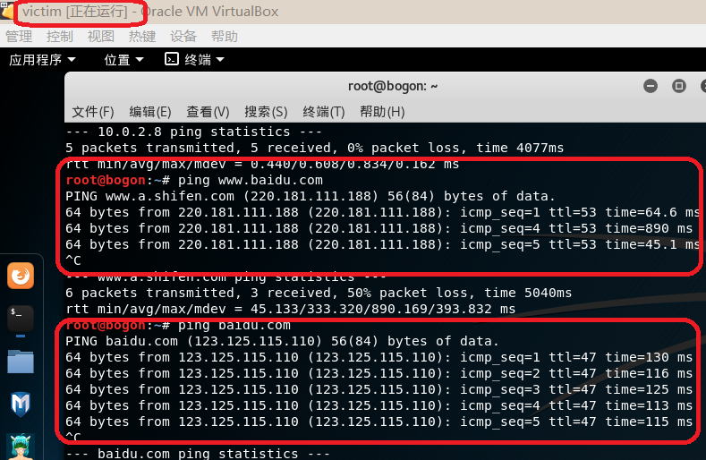
- 靶机也能成功ping通攻击主机
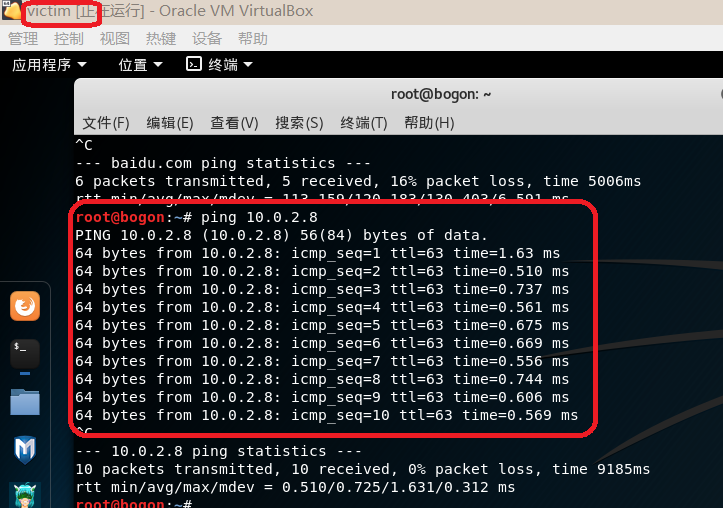
- 攻击者主机ping不通靶机
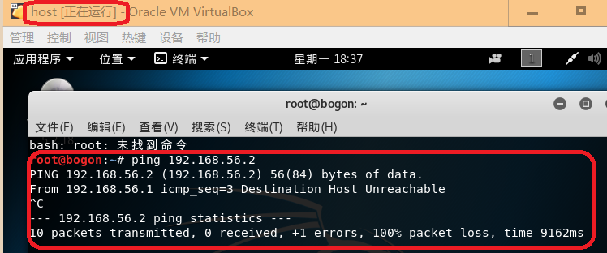
- 网关可以直接访问攻击者主机和靶机
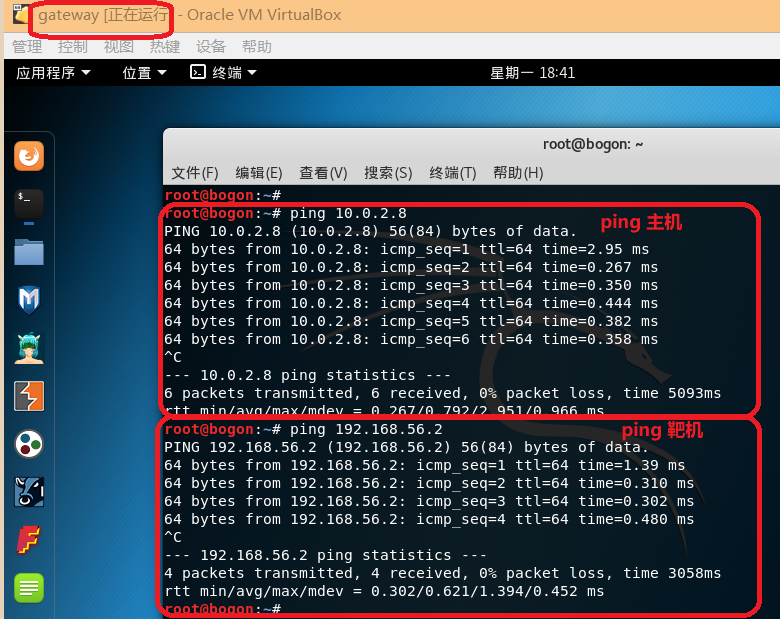
- 所有节点均可以访问互联网（靶机可以ping通外网上文中已经成功）
	- 网关可以ping通外网
	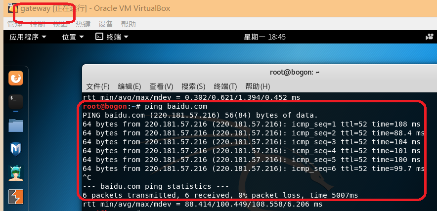
	- 攻击者主机可以ping通外网
	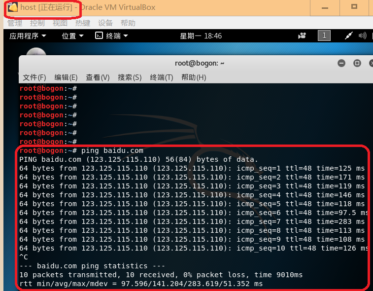
- 靶机的所有对外上下行流量必须经过网关
	- 开启网关的监听 
	tcpdump -n -i eth0 icmp
	tcpdump -n -i eth1 icmp
	- 靶机的所有流量都经过网关
	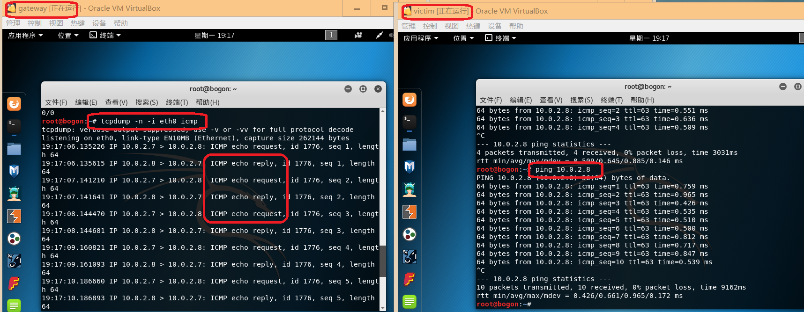
	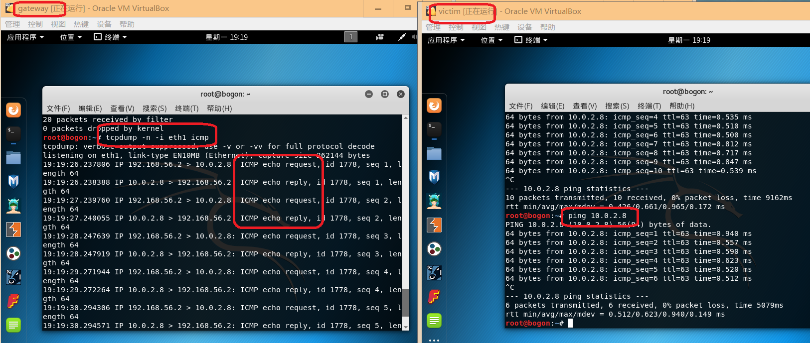
- 所有节点制成基础镜像（多重加载的虚拟硬盘）
  1. 需要对原始的vdi进行释放
  2. 释放后就可以更改普通为多重加载并应用
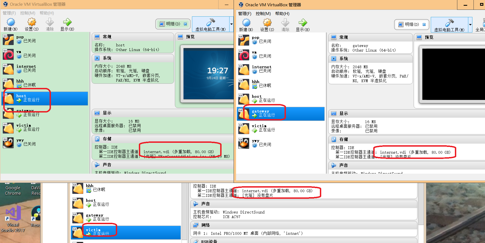
