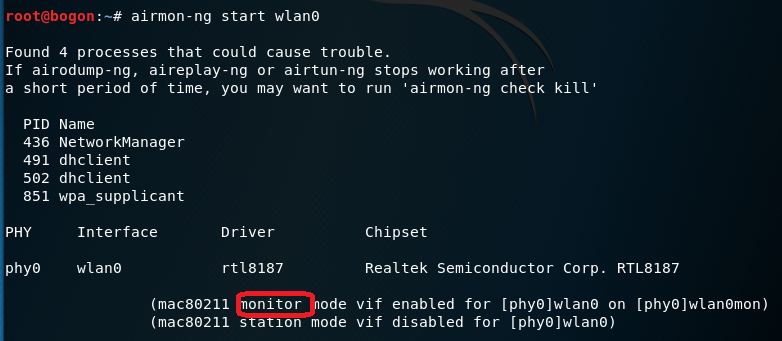
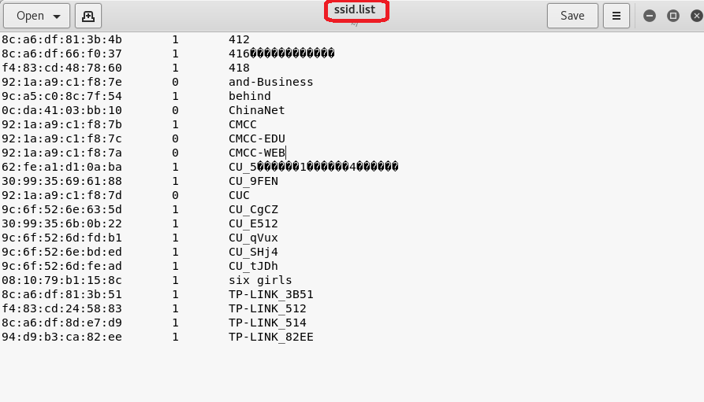
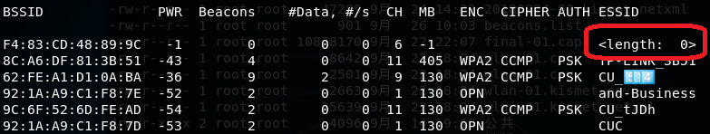

# **chap0x02实验报告**  
## **一、无线网卡相关信息：**  
1. 网卡：Realtek RTL8187    
  
2. 查看物理网卡的硬件和软件特性支持情况      

		Wiphy phy3
		    max # scan SSIDs: 4
		    max scan IEs length: 2285 bytes
		    max # sched scan SSIDs: 0
		    max # match sets: 0
		    max # scan plans: 1
		    max scan plan interval: -1
		    max scan plan iterations: 0
		    Retry short limit: 7
		    Retry long limit: 4
		    Coverage class: 0 (up to 0m)
		    Device supports RSN-IBSS.
		    Supported Ciphers:
		        * WEP40 (00-0f-ac:1)
		        * WEP104 (00-0f-ac:5)
		        * TKIP (00-0f-ac:2)
		        * CCMP-128 (00-0f-ac:4)
		        * CCMP-256 (00-0f-ac:10)
		        * GCMP-128 (00-0f-ac:8)
		        * GCMP-256 (00-0f-ac:9)
		    Available Antennas: TX 0 RX 0
		    Supported interface modes:
		         * IBSS
		         * managed
		         * monitor
		    Band 1:
		        Bitrates (non-HT):
		            * 1.0 Mbps
		            * 2.0 Mbps
		            * 5.5 Mbps
		            * 11.0 Mbps
		            * 6.0 Mbps
		            * 9.0 Mbps
		            * 12.0 Mbps
		            * 18.0 Mbps
		            * 24.0 Mbps
		            * 36.0 Mbps
		            * 48.0 Mbps
		            * 54.0 Mbps
		        Frequencies:
		            * 2412 MHz [1] (20.0 dBm)
		            * 2417 MHz [2] (20.0 dBm)
		            * 2422 MHz [3] (20.0 dBm)
		            * 2427 MHz [4] (20.0 dBm)
		            * 2432 MHz [5] (20.0 dBm)
		            * 2437 MHz [6] (20.0 dBm)
		            * 2442 MHz [7] (20.0 dBm)
		            * 2447 MHz [8] (20.0 dBm)
		            * 2452 MHz [9] (20.0 dBm)
		            * 2457 MHz [10] (20.0 dBm)
		            * 2462 MHz [11] (20.0 dBm)
		            * 2467 MHz [12] (20.0 dBm) (no IR)
		            * 2472 MHz [13] (20.0 dBm)
		            * 2484 MHz [14] (20.0 dBm) (no IR)
		    Supported commands:
		         * new_interface
		         * set_interface
		         * new_key
		         * start_ap
		         * new_station
		         * new_mpath
		         * set_mesh_config
		         * set_bss
		         * authenticate
		         * associate
		         * deauthenticate
		         * disassociate
		         * join_ibss
		         * join_mesh
		         * set_tx_bitrate_mask
		         * frame
		         * frame_wait_cancel
		         * set_wiphy_netns
		         * set_channel
		         * set_wds_peer
		         * probe_client
		         * set_noack_map
		         * register_beacons
		         * start_p2p_device
		         * set_mcast_rate
		         * connect
		         * disconnect
		         * set_qos_map
		         * set_multicast_to_unicast
		    Supported TX frame types:
		         * IBSS: 0x00 0x10 0x20 0x30 0x40 0x50 0x60 0x70 0x80 0x90 0xa0 0xb0 0xc0 0xd0 0xe0 0xf0
		         * managed: 0x00 0x10 0x20 0x30 0x40 0x50 0x60 0x70 0x80 0x90 0xa0 0xb0 0xc0 0xd0 0xe0 0xf0
		         * AP: 0x00 0x10 0x20 0x30 0x40 0x50 0x60 0x70 0x80 0x90 0xa0 0xb0 0xc0 0xd0 0xe0 0xf0
		         * AP/VLAN: 0x00 0x10 0x20 0x30 0x40 0x50 0x60 0x70 0x80 0x90 0xa0 0xb0 0xc0 0xd0 0xe0 0xf0
		         * mesh point: 0x00 0x10 0x20 0x30 0x40 0x50 0x60 0x70 0x80 0x90 0xa0 0xb0 0xc0 0xd0 0xe0 0xf0
		         * P2P-client: 0x00 0x10 0x20 0x30 0x40 0x50 0x60 0x70 0x80 0x90 0xa0 0xb0 0xc0 0xd0 0xe0 0xf0
		         * P2P-GO: 0x00 0x10 0x20 0x30 0x40 0x50 0x60 0x70 0x80 0x90 0xa0 0xb0 0xc0 0xd0 0xe0 0xf0
		         * P2P-device: 0x00 0x10 0x20 0x30 0x40 0x50 0x60 0x70 0x80 0x90 0xa0 0xb0 0xc0 0xd0 0xe0 0xf0
		    Supported RX frame types:
		         * IBSS: 0x40 0xb0 0xc0 0xd0
		         * managed: 0x40 0xd0
		         * AP: 0x00 0x20 0x40 0xa0 0xb0 0xc0 0xd0
		         * AP/VLAN: 0x00 0x20 0x40 0xa0 0xb0 0xc0 0xd0
		         * mesh point: 0xb0 0xc0 0xd0
		         * P2P-client: 0x40 0xd0
		         * P2P-GO: 0x00 0x20 0x40 0xa0 0xb0 0xc0 0xd0
		         * P2P-device: 0x40 0xd0
		    software interface modes (can always be added):
		         * monitor
		    interface combinations are not supported
		    HT Capability overrides:
		         * MCS: ff ff ff ff ff ff ff ff ff ff
		         * maximum A-MSDU length
		         * supported channel width
		         * short GI for 40 MHz
		         * max A-MPDU length exponent
		         * min MPDU start spacing
		    Device supports TX status socket option.
		    Device supports HT-IBSS.
		    Device supports SAE with AUTHENTICATE command
		    Device supports low priority scan.
		    Device supports scan flush.
		    Device supports AP scan.
		    Device supports per-vif TX power setting
		    Driver supports full state transitions for AP/GO clients
		    Driver supports a userspace MPM
		    Device supports configuring vdev MAC-addr on create.
		
## **二、知识准备：**    
### 1. IEEE802.11 链路层数据帧    
-  802.11的帧格式类似于以太网，但是更加复杂。（以下列举此次实验可能会用到的帧）    
  - ** 信标帧（Beacons）： **周期性发送有规律的AP，主要用于定位和通信使用。Beacon帧中包含了SSID，Source address等信息。  **（wlan.fc.type_subtype == 0x08）**    
  - ** 探测请帧 (Probe request）： ** 请求STA向指定的SSID发送请求或广播，希望得到可关联AP的回应。  ** （wlan.fc.type_subtype == 0x04） **   
  - ** 探测响应帧（Probe response）： ** AP回复，表明自己收到了STA的Probe request并允许进行身份认证。      
  **（wlan.fc.type_subtype == 0x05）**   
  - ** ACK帧 (Acknowledgement）： ** 确认接收到数据。    
  ** （wlan.fc.type_subtype == 0x1d） **   
### 2. 认证无加密连接交互过程    
1. AP广播Beacon帧    
2. STA向指定的SSID发送Probe request帧（或者直接广播）    
3. AP对STA的SSID请求回复Probe response帧    
4. STA定向发送Authentication请求进行身份认证    
5. AP对Authentication做出回应    
6. STA定向AP发送Association请求连接    
7. AP对连接回复Association Response    
## **三、实验过程：**   
1. 查看无线网卡参数配置，确保无线网卡的工作模式是managed，且Access Poit值为Not-Associated    
    
2. 仅查看附近无线网络的SSID    
   
3. 自动处理UTF-8编码的SSID名称      
   
4. 开启无线网卡的监听模式并查看监听模式是否开启      
	 
			airmon-ng start wlan0  
			iwconfig  

    
    
5. 开始抓包，将抓包结果保存到文件并查看文件     
   
   

> - 监听中的各参数含义    
> 	- BSSID：表示无线 AP 的 Mac 地址。   
> 	- PWR：信号强度，值越大，表示信号越强。它的值一般都是一个负数，所以上图中 -18 是最大的，表示该接入点离的最近，信号最好。若 PWR 值为 -1，说明不支持信号强度的查看。  
> 	- Beacon 无线AP发出的通告编号
> 	- #Data：捕获到的数据分组的数量，包括广播分组。   
> 	- CH：信道号。   
> 	- MB：WAP 所支持的最大速率。   
> 	- ENC：使用的加密算法体系。OPN 表示无加密，WEP 表示静态的或者动态的 WEP（ WEP 加密很早就已经被淘汰了 ）目前最常见的是 WPA 和 WPA2。     
> 	- CIPHER：使用的加密算法。常见的算法有：CCMP、WRAAP、TKIP、WEP 等。    
> 	- AUTH：使用的认证协议。常用的有：MGT（在我监听的网络中只有CMCC网络属于此类型）（WPA/WPA2 使用独立的认证服务器，譬如 802.1x、RADIUS、EAP 等），SKA（WEP 的共享密钥），PSK（WPA/WPA2 的预共享密钥）和 OPN（开放式）。        
> 	- ESSID：所谓的 SSID 号，如果启用隐藏的话，ESSID 可以为空，或者显示为 <length: 0>。      
> 	- STATION：客户端的 Mac 地址，包括连上的和想要连的客户端。如果客户端没有连上 AP，ESSID 列显示成 (not associated)。     
> 	- Probe：被客户端查探的 ESSID，如果客户端正在试图连接一个 AP，但是没有连接上，将会显示在这里。    
> 	- Rate：表示传输率   
> 	- Lost：在过去 10 秒钟内丢失的数据分组，基于序列号检测。它意味着从客户端来的数据丢包，每个非管理帧中都有一个序列号字段，把刚接收到的那个帧中的序 列号和前一个帧中的序列号相减就可以知道丢了几个包。  
> 	- Frames：客户端发送的数据分组数量。   

6. 用wireshark分析抓到的cap包       
    
7. 可以在无线——>WLAN流量中看到无线包     
    
## **三、通过分析抓包回答问题**     
### 数据统计     
- 通过wireshark查看到总共抓取205个包      
     

#### 1. 查看统计当前信号覆盖范围内一共有多少独立的SSID？其中是否包括隐藏SSID？哪些无线热点是加密/非加密的？加密方式是否可知？      
- 根据Beacons帧获得AP的SSID     
	- SSID用于区分不同的网络，无线网卡设置了不同的SSID就可以进入不同的网络。    
   
			   tshark -r 20180924-02.cap -Y wlan.fc.type_subtype==0x08 -T fields -e wlan.sa -e wlan.fixed.capabilities.privacy -e wlan.ssid | sort -d -u > beacon.list 
	    		# -Y 筛选器
	    		# -T 输出格式
	    		# -e 如果-T选择了field，此项用来选择
	    		# -d 排序时，处理英文字母、数字及空格字符外，忽略其他的字符；
	    		# -u 忽略相同行  
  
	- 选择Probe Response帧，将SSID列表写入文件中    
	    
			tshark -r 20180924-02.cap -Y wlan.fc.type_subtype==0x05 -T fields -e wlan.sa -e wlan.fixed.capabilities.privacy -e wlan.ssid| sort -d -u > probres.list 

	- 将beacons.list、Probes.list中的SSID进行合并，同名SSID只取一个     
		  
			sort -m probres.list beacon.list | sort -k3 -u > ssid.list
		    
	    
	- 经过统计得出该无线信号覆盖范围内共有26个独立的SSID。       
	     
	- 其中所包含的隐藏的SSID        
	    
		- 从截图看出隐藏的SSID没有具体的SSID，但是具有length:0等类似标识
		- 其实隐藏的SSID在广播Beacons帧时，会出现如下几种情况：
			- 按照真实ESSID的长度，十六进制的0×00进行相同长度的填充
			- 不填充，留空
			- 填充随机数量的0x00（可填充1字节0x00）
			- 填充固定长度的0x00
		- 存在不广播Beacons帧的情况
		- 根据截图，通过airodump-ng wlan0mon 可以看出隐藏的SSID的SSID具有length:0等类似标识)      
	- 通过截图可以得到传输数据包无线热点是否加密以及具体的加密方式。      
	    
		- （由上文所提参数可知）在ENC列，无加密标记为OPN，加密标记为具体的加密方式 WAP 、WPA2；在CIPHER列可知使用的加密算法。常见的算法有：CCMP。    
	- 加密也可根据Beacon帧的wlan.fixed.capabilities.privacy判断（由ssid.list中的第二行信息可得）   
		- WEP 1加密 / 0未加密    
		- 因此ssid.list中第二列为1的是加密的，为0的是未加密的      
	    
 
#### 2. 如何分析出一个指定手机在抓包时间窗口内在手机端的无线网络列表可以看到哪些SSID？这台手机尝试连接了哪些SSID？最终加入了哪些SSID？   
-  在无线信号覆盖范围内，收到了AP广播的Beacon帧且SSID不为空时，指定手机才能在无线网络列表中看到该SSID；手机搜寻无线热点时，会广播Probe Request帧，手机就会收到AP返回的Probe Response帧，这样就知道这台手机尝试连接了哪些SSID，最终加入了哪些SSID   
    
      
    
 	- 可以看到手机最终加入了SSID为CU_tJDh的网络  

#### 3. SSID包含在哪些类型的802.11帧？  
  

- 根据所抓取到的包来看，至少以上三种帧包含SSID字段  

## **四、实验总结：**
- 在分析分析 “ 一个指定手机在抓包时间窗口内在手机端的无线网络列表可以看到哪些SSID？这台手机尝试连接了哪些SSID？最终加入了哪些SSID？” 这个问题的时候，会广播Probe request帧，我发现在wireshark抓到的包中SSID会有wildcard，是通配符，然后可以看到其实SSID为空，我的理解是 如果某AP的SSID是隐藏的，那么通常手机发送的普通的probe request包是无法获取到隐藏的SSID，必须在probe request包中指定SSID才可以扫描到隐藏的SSID。所以在SSID为0的时候probe request不包含具体的SSID信息，如果某个AP隐藏了SSID，就不回应这种probe request。
## **五、实验参考：**
[http://www.tup.tsinghua.edu.cn/upload/books/yz/067209-01.pdf ](http://www.tup.tsinghua.edu.cn/upload/books/yz/067209-01.pdf )    
[https://github.com/CUCCS/2018-NS-Public-TheMasterOfMagic/pull/3](https://github.com/CUCCS/2018-NS-Public-TheMasterOfMagic/pull/3)    
[https://github.com/CUCCS/2018-NS-Public-jckling/pull/3](https://github.com/CUCCS/2018-NS-Public-jckling/pull/3)  

